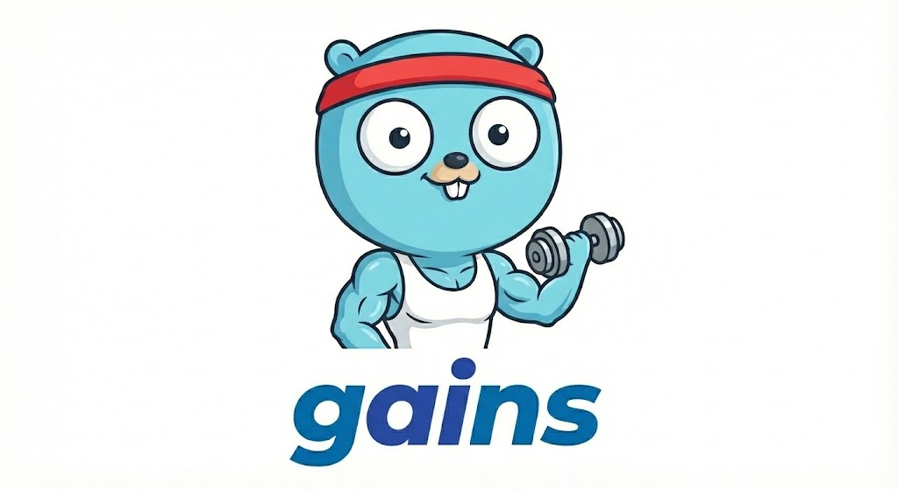

<p align="center">
  
</p>

# gains

**Go AI Native Scaffold** - A Go-idiomatic generative AI library. Not yet production ready.

gains provides a unified interface for building AI applications across Anthropic, OpenAI, and Google. Built from the ground up for Go with first-class streaming, tool orchestration, and composable workflows.

Most AI agent frameworks either don't support Go or treat it as an afterthought. gains was built to give Go developers a first-class experience.

## Principles

- **Go Idiomatic** - Follows Go conventions: interfaces, functional options, channels, context
- **Type Safe** - Generics and typed keys wherever possible to catch errors at compile time
- **Composable** - Small, focused components that combine into larger systems
- **Flexible** - Sensible defaults with full control when you need it
- **Easy to Use** - Trivial for simple cases, capable for complex problems

## Features

- **Model-Centric Routing** - Models know their provider; client routes automatically
- **Unified Client** - Single interface for chat, embeddings, and image generation
- **Agent Orchestration** - Autonomous tool-calling loops with approval workflows
- **Composable Workflows** - Chain, Parallel, Router, and Loop patterns for complex pipelines
- **Built-in Tools** - File, HTTP, search, and client tools ready to use
- **AG-UI Protocol** - Frontend integration via event mapping and shared state
- **A2A Protocol** - Agent-to-agent communication (testing)
- **MCP Protocol** - Model Context Protocol for tool interoperability (testing)
- **Streaming First** - Channel-based streaming throughout the entire API
- **Automatic Retry** - Exponential backoff with jitter for transient errors

## Installation

```bash
go get github.com/spetersoncode/gains
```

## Import Convention

We recommend importing with the `ai` alias for cleaner, more readable code:

```go
import ai "github.com/spetersoncode/gains"

// Now you can write:
msg := ai.Message{Role: ai.RoleUser, Content: "Hello"}
```

## Quick Start

```go
package main

import (
    "context"
    "fmt"
    "os"

    ai "github.com/spetersoncode/gains"
    "github.com/spetersoncode/gains/client"
    "github.com/spetersoncode/gains/model"
)

func main() {
    ctx := context.Background()

    c := client.New(client.Config{
        APIKeys: client.APIKeys{
            Anthropic: os.Getenv("ANTHROPIC_API_KEY"),
        },
        Defaults: client.Defaults{
            Chat: model.ClaudeSonnet45,
        },
    })

    resp, _ := c.Chat(ctx, []ai.Message{
        {Role: ai.RoleUser, Content: "Hello!"},
    })

    fmt.Println(resp.Content)
}
```

## Providers

Models determine their provider automatically. Configure API keys for the providers you use:

| Provider  | Chat | Images | Embeddings |
|-----------|:----:|:------:|:----------:|
| Anthropic | ✓    | -      | -          |
| OpenAI    | ✓    | ✓      | ✓          |
| Google    | ✓    | ✓      | ✓          |

```go
c := client.New(client.Config{
    APIKeys: client.APIKeys{
        Anthropic: os.Getenv("ANTHROPIC_API_KEY"),
        OpenAI:    os.Getenv("OPENAI_API_KEY"),
        Google:    os.Getenv("GOOGLE_API_KEY"),
    },
    Defaults: client.Defaults{
        Chat:      model.ClaudeSonnet45,      // Routes to Anthropic
        Embedding: model.TextEmbedding3Small, // Routes to OpenAI
        Image:     model.Imagen4,             // Routes to Google
    },
})

// Uses default model (ClaudeSonnet45 -> Anthropic)
resp, _ := c.Chat(ctx, messages)

// Override with different model (routes to OpenAI)
resp, _ = c.Chat(ctx, messages, ai.WithModel(model.GPT52))
```

## Chat & Streaming

```go
// Basic chat
resp, _ := c.Chat(ctx, messages)
fmt.Println(resp.Content)

// Streaming
stream, _ := c.ChatStream(ctx, messages)
for event := range stream {
    if event.Err != nil {
        break
    }
    fmt.Print(event.Delta)
}
```

## Schema Generation

Define schemas using struct tags. The library auto-generates JSON schemas from Go structs:

```go
type WeatherArgs struct {
    Location string `json:"location" desc:"City name" required:"true"`
    Unit     string `json:"unit" enum:"celsius,fahrenheit"`
    Days     int    `json:"days" min:"1" max:"7"`
}

// Generate schema from struct tags
schema := ai.MustSchemaFor[WeatherArgs]()
```

Supported tags: `json`, `desc`, `required`, `enum`, `min`, `max`, `minLength`, `maxLength`, `pattern`, `default`, `minItems`, `maxItems`

## Agent Orchestration

The agent package handles autonomous tool-calling loops:

```go
import (
    "github.com/spetersoncode/gains/agent"
    "github.com/spetersoncode/gains/tool"
)

type SearchArgs struct {
    Query string `json:"query"`
}

// Create a tool registry
registry := tool.NewRegistry()
tool.MustRegisterFunc(registry, "search", "Search the web",
    func(ctx context.Context, args SearchArgs) (string, error) {
        return "search results for: " + args.Query, nil
    },
)

// Create and run agent
a := agent.New(c, registry)

result, _ := a.Run(ctx, messages,
    agent.WithMaxSteps(10),
    agent.WithTimeout(2*time.Minute),
)
fmt.Println(result.Response.Content)
```

### Human-in-the-Loop

Require approval for sensitive operations:

```go
result, _ := a.Run(ctx, messages,
    agent.WithApprovalRequired("delete_file", "send_email"),
    agent.WithApprover(func(ctx context.Context, call ai.ToolCall) (bool, string) {
        fmt.Printf("Allow %s? [y/n]: ", call.Name)
        // Get user input...
        return approved, ""
    }),
)
```

## Workflows

Build complex pipelines with composable patterns. See [docs/workflows.md](docs/workflows.md) for comprehensive documentation.

```go
import "github.com/spetersoncode/gains/workflow"

// Chain - sequential execution
chain := workflow.NewChain("pipeline",
    workflow.NewPromptStep("analyze", c, analyzePrompt, "analysis"),
    workflow.NewPromptStep("summarize", c, summarizePrompt, "summary"),
)

// Parallel - concurrent execution
parallel := workflow.NewParallel("research",
    []workflow.Step{step1, step2, step3},
    aggregator,
)

// Router - conditional branching
router := workflow.NewRouter("route",
    []workflow.Route{
        {Name: "question", Condition: isQuestion, Step: questionHandler},
    },
    defaultHandler,
)

// Execute workflow
wf := workflow.New("my-workflow", chain)
result, _ := wf.Run(ctx, workflow.NewState(nil))
```

### Typed Workflow Steps

Use `TypedPromptStep[T]` with `Key[T]` for compile-time type safety:

```go
type Analysis struct {
    Sentiment  string   `json:"sentiment"`
    Keywords   []string `json:"keywords"`
}

// Define typed key
var KeyAnalysis = workflow.NewKey[*Analysis]("analysis")

// Create typed step - result auto-unmarshaled
step := workflow.NewTypedPromptStep[Analysis](
    "analyze", c, promptFn, responseSchema, KeyAnalysis.Name(),
)

// Type-safe state access
analysis, ok := workflow.Get(state, KeyAnalysis)
analysis = workflow.MustGet(state, KeyAnalysis)
```

## Built-in Tools

The `tool` package provides ready-to-use tools:

```go
import "github.com/spetersoncode/gains/tool"

// File tools: read_file, write_file, list_directory, edit_file
fileTools := tool.FileTools(tool.WithBasePath("/allowed/path"))

// HTTP tool: http_request
httpTool := tool.WebTools(tool.WithAllowedHosts("api.example.com"))

// Search tool: search_files
searchTools := tool.SearchTools()

// Client tools: generate_image, embed_text, ask_assistant
clientTools := tool.ClientTools(c)

// Register all tools
tool.RegisterAll(registry, tool.StandardTools())
```

## AG-UI Protocol

The `agui` package maps gains events to AG-UI format for frontend integration:

```go
import "github.com/spetersoncode/gains/agui"

mapper := agui.NewMapper(threadID, runID)
writeEvent(mapper.RunStarted())

for event := range agent.RunStream(ctx, messages) {
    for _, aguiEvent := range mapper.MapEvent(event) {
        writeEvent(aguiEvent)
    }
}

writeEvent(mapper.RunFinished())
```

## Structured Output

```go
type Result struct {
    Name  string `json:"name" required:"true"`
    Score int    `json:"score" min:"0" max:"100"`
}

resp, _ := c.Chat(ctx, messages,
    ai.WithResponseSchema(ai.ResponseSchema{
        Name:   "result",
        Schema: ai.MustSchemaFor[Result](),
    }),
)
```

## Embeddings & Images

```go
// Embeddings
resp, _ := c.Embed(ctx, []string{"Hello world"})
fmt.Printf("Dimensions: %d\n", len(resp.Embeddings[0]))

// Image generation
resp, _ := c.GenerateImage(ctx, "A sunset over mountains",
    ai.WithImageSize(ai.ImageSize1024x1024),
)
fmt.Println(resp.Images[0].URL)
```

## Models

The `model` package provides type-safe model selection:

```go
import "github.com/spetersoncode/gains/model"

// Auto-updating aliases
ai.WithModel(model.ClaudeSonnet45)  // Anthropic
ai.WithModel(model.GPT52)           // OpenAI
ai.WithModel(model.Gemini25Flash)   // Google

// Pinned versions for stability
ai.WithModel(model.ClaudeSonnet45_20250929)
```

## Request Options

```go
resp, _ := c.Chat(ctx, messages,
    ai.WithModel(model.ClaudeOpus45),
    ai.WithMaxTokens(4096),
    ai.WithTemperature(0.7),
    ai.WithTools(tools),
    ai.WithToolChoice(ai.ToolChoiceAuto),
)
```

## Configuration

### Retry

```go
c := client.New(client.Config{
    APIKeys: client.APIKeys{OpenAI: os.Getenv("OPENAI_API_KEY")},
    RetryConfig: &retry.Config{
        MaxAttempts:  5,
        InitialDelay: time.Second,
        MaxDelay:     30 * time.Second,
    },
})
```

### Events

```go
events := make(chan client.Event, 100)
c := client.New(client.Config{
    APIKeys: client.APIKeys{OpenAI: os.Getenv("OPENAI_API_KEY")},
    Events:  events,
})

go func() {
    for e := range events {
        fmt.Printf("[%s] %s %v\n", e.Type, e.Operation, e.Duration)
    }
}()
```

## Environment Variables

| Provider  | Variable            |
|-----------|---------------------|
| Anthropic | `ANTHROPIC_API_KEY` |
| OpenAI    | `OPENAI_API_KEY`    |
| Google    | `GOOGLE_API_KEY`    |

## Examples

See the [`cmd/demo`](cmd/demo) directory for complete examples including:
- Basic chat and streaming
- Agent orchestration
- Multi-agent scenarios
- Workflow patterns (chain, parallel, router, loop)
- AG-UI integration
- Structured output
- Vision and embeddings

### AG-UI Server

The [`cmd/serve`](cmd/serve) directory contains a reference HTTP server that exposes a gains agent via the AG-UI protocol over SSE.

**Features:**
- ✅ Chat streaming
- ✅ Client-side tools
- ✅ Server-side tools
- ✅ Generative UI elements
- ✅ Shared state
- ✅ Human in the loop

```bash
GAINS_PROVIDER=anthropic go run ./cmd/serve
# POST http://localhost:8000/api/agent
```

## License

MIT
